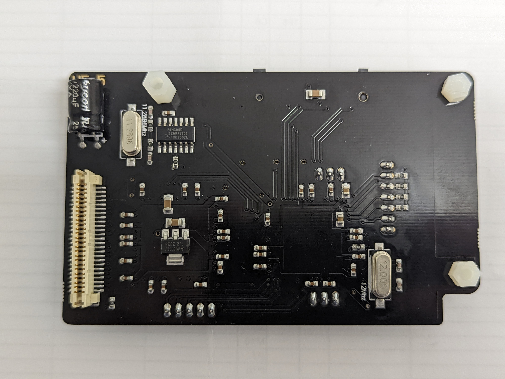

# Reverse Engineering of GDEMU Clone PCBs

## Intro
I spent my Christmas vacation annoying my family with the beeping from my multimeter and 
these are my notes transcribed here. All of this information was obtained from 5.5 and 5.15 GDEMU 
clones from ebay/aliexpress to figure out how the chips were connected.  Please let me know of any inaccuracies or if anything should be clarified. 

## Photos

White dot indicates pin 1 on headers

Top:

Bottom:

## Part List

| ID   | Part Number         | Part Description                                                                   |
|------|---------------------|------------------------------------------------------------------------------------|
| MCU  | SAM3U4EA-AU         | ARM MCU                                                                            |
| FPGA | EP2C5T144C8N        | Cyclone 2 FPGA                                                                     |
|      | 11.2896 MHz Crystal | Used to generate clock for audio, DC will have werid boot animation without signal |
|      | 12MHz Crystal       | Crystal for the SAM3U MCU                                                          |

## Connections

### SAM3U <-> H1
I've only used SWD debug since I already had a Picoprobe on my desk
| Header Pin | Connection   |
|------------|--------------|
| 1          | 3.3V         |
| 2          | TDI          |
| 3          | TDO/TRACESWO |
| 4          | TMS/SWDIO    |
| 5          | TCK/SWCLK    |
| 6          | NRST         |
| 7          | GND          |

### SAM3U <-> H2
| Header Pin | Connection |
|------------|------------|
| 1          | GND        |
| 2          | PA29       |
| 3          | PA31       |

### SAM3U <-> H3
| Header Pin | Connection |
|------------|------------|
| 1          | 3.3V       |
| 2          | PC28       |
| 3          | PC29       |
| 4          | PC30       |
| 5          | PC31       |

### SAM3U <-> H4
Note that this header seems to have been removed from my v5.15b clones and as such the v5.5 board is
where my development is happening simply due to these pins having UART TX/RX muxing to the SAM3U
| Header Pin | Connection |
|------------|------------|
| 1          | PA11 - RX  |
| 2          | PA12 - TX  |
| 3          | GND        |

### SAM3U <-> Misc
| SAM3U Pin | Connection     |
|-----------|----------------|
| PA1       | SD Card Detect |
| PA20      | Button         |
| PB18      | Red LED        |
| XOUT      | 12 MHz Crystal |
| XIN       | 12 MHz Crystal |

### Cyclone 2 <-> SAM3U Connections

#### FPGA Programing
| Cyclone Pin | SAM3U Pin |
|-------------|-----------|
| DATA0       | PA23      |
| DCLK        | PA24      |
| nCONFIG     | PA25      |
| CONF_DONE   | PB1       |
| nSTATUS     | PB2       |

#### FPGA Design
##### SMC Connections
| Cyclone2 Pin | SAM3U Pin | Signal Purpose |
|--------------|-----------|----------------|
| 64           | PB6       | SMC D15        |
| 63           | PB7       | SMC A0/NBS0    |
| 60           | PB8       | SMC A1         |
| 71           | PB9       | SMC D0         |
| 72           | PB10      | SMC D1         |
| 69           | PB11      | SMC D2         |
| 67           | PB12      | SMC D3         |
| 65           | PB13      | SMC D4         |
| 73           | PB14      | SMC D5         |
| 52           | PB15      | SMC D6         |
| 53           | PB16      | SMC D7         |
| 74           | PB19      | SMC NRD        |
| 24           | PB23      | SMC NWR0/NWE   |
| 25           | PB25      | SMC D8         |
| 26           | PB26      | SMC D9         |
| 27           | PB27      | SMC D10        |
| 28           | PB28      | SMC D11        |
| 30           | PB29      | SMC D12        |
| 31           | PB30      | SMC D13        |
| 32           | PB31      | SMC D14        |
| 48           | PC0       | SMC A2         |
| 47           | PC1       | SMC A3         |
| 45           | PC2       | SMC A4         |
| 44           | PC3       | SMC A5         |
| 43           | PC4       | SMC A6         |
| 42           | PC5       | SMC A7         |
| 41           | PC6       | SMC A8         |
| 57           | PC15      | SMC NWR1/NBS1  |
| 55           | PC17      | SMC NCS3       |

##### Other Connections
Unsure of how these were used in the original FW so listing what they're used for here
| Cyclone2 Pin | SAM3U Pin | Signal Purpose                 |
|--------------|-----------|--------------------------------|
| 59           | PA22      | IRQn                           |
| 51           | PA26      | Unused                         |
| 70           | PA28      | 48MHz Clock from SAM3U (PWMH0) |
| 58           | PA30      | Logic Reset                    |

### Cyclone 2 <-> G1 Connector
| Cyclone Pin | G1 Pin   |
|-------------|----------|
| 7           | LRCK     |
| 8           | CDCLK    |
| 132         | EMPH     |
| 141         | SCK      |
| 142         | SDAT     |
| 143         | ADDR[2]  |
| 139         | ADDR[1]  |
| 135         | ADDR[0]  |
| 136         | CSn[0]   |
| 144         | CSn[1]   |
| 142         | SDAT     |
| 137         | INTRQ    |
| 134         | IORDY    |
| 133         | WRn      |
| 129         | DACKn    |
| 125         | DMARQ    |
| 126         | RDn      |
| 122         | DATA[15] |
| 121         | DATA[0]  |
| 120         | DATA[14] |
| 119         | DATA[1]  |
| 118         | DATA[12] |
| 115         | DATA[3]  |
| 114         | DATA[13] |
| 113         | DATA[2]  |
| 112         | DATA[10] |
| 104         | DATA[5]  |
| 103         | DATA[8]  |
| 101         | DATA[7]  |
| 100         | RSTn     |
| 99          | DATA[11] |
| 97          | DATA[4]  |
| 96          | DATA[9]  |
| 94          | DATA[6]  |

### Cyclone 2 <-> Misc
| Cyclone Pin | Connection          |
|-------------|---------------------|
| 21          | 11.2896 MHz Crystal |
| 22          | 11.2896 MHz Crystal |
| MSEL1 (84)  | GND                 |
| MSEL0 (85)  | 3.3V                |

